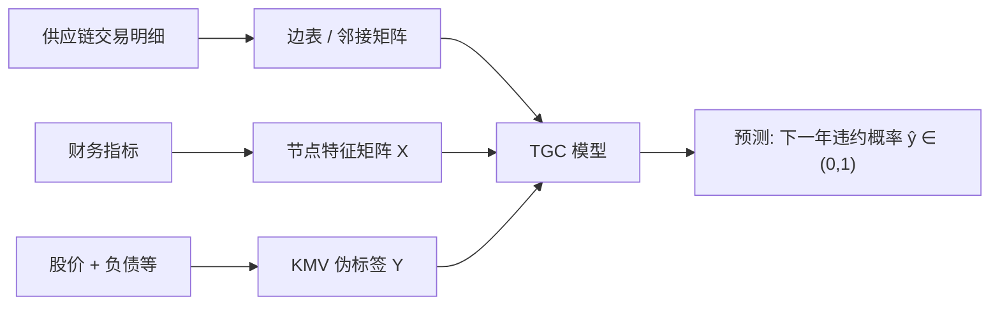
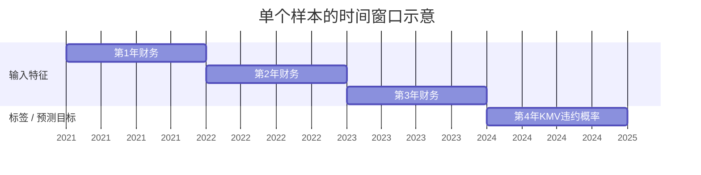
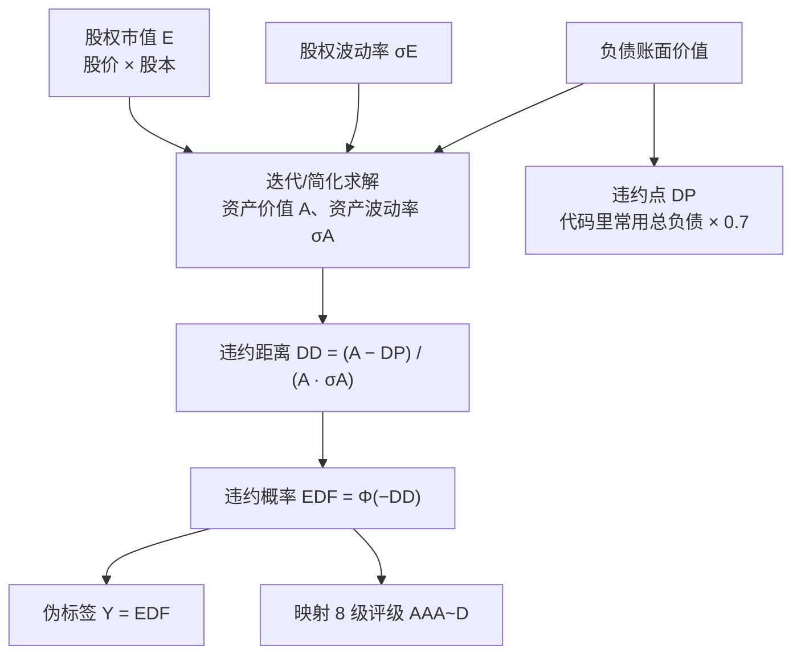
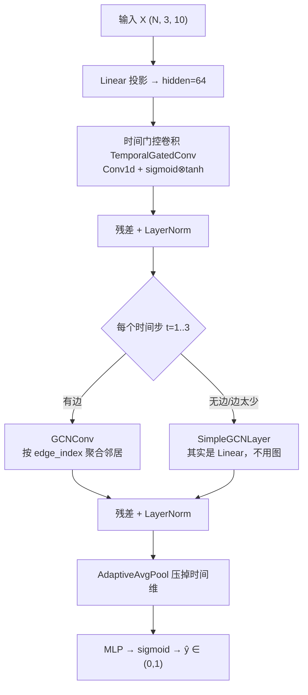
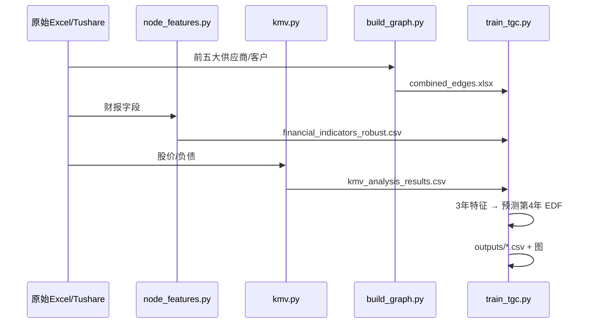

# FIN —— 基于图机器学习的供应链金融风险评估

> 🚀 **第一次上手？请先看 [QUICKSTART.md](QUICKSTART.md)**（部署/配置/训练/扩展速查）。

本仓库对原始的「过程数据 + 前辈代码」做了目录重构，并已用 **KMV 违约概率作为伪标签**跑通了 TGC（时序图卷积）训练基线。

下文按「业务问题 → 数据长什么样 → 标签怎么来 → 模型怎么搭 → 输出是什么意思」说明前辈方案，便于接手学习（对应汇报 PPT「图灵风控」）。

---

## 1. 一句话在做什么

> 用上市公司**供应链交易关系**建图，用每家公司的**财务指标**做节点特征，用 **KMV 算出的违约概率**当监督标签；模型吃「连续 3 年」的特征，预测「第 4 年」的违约概率。

这是**回归任务**（拟合 0~1 之间的概率），不是买卖股票的量化交易模型；目标是给供应链金融的授信/风控提供下一年度风险估计。



---

## 2. 目录结构

```
FIN/
├── src/
│   └── legacy/                 # 前辈原始代码（迁移 + 路径/对齐适配）
│       ├── train_tgc.py        # ★ 主训练脚本（TGC，三年预测第四年）
│       ├── node_features.py    # 财务节点特征抓取（Tushare）
│       ├── kmv.py              # KMV 信用风险标签计算（较全版本）
│       ├── kmv_simple.py       # KMV 简化版
│       └── build_graph.py      # 供应链网络/边表构建与可视化
├── data/
│   ├── raw/                    # 原始供应链交易数据（Excel）
│   └── processed/              # 训练直接使用的数据
│       ├── financial_indicators_robust.csv   # 节点财务特征
│       ├── kmv_analysis_results.csv          # KMV 伪标签（default_probability）
│       └── combined_edges.xlsx               # 供应链边表
├── test/                       # 冒烟测试
├── outputs/                    # 训练产物（每次运行生成 legacy_tgc_<时间戳>/）
├── requirements.txt
├── LLM增强TGC供应链风控_设计文档.md   # 后续 LLM Agent 增强方案（可选阅读）
└── README.md
```

> 原始的 `2-过程部分数据/` 目录可保留作备份，确认新结构无误后可自行删除。

---

## 3. 输入数据长什么样

训练时实际读入的是 `data/processed/` 下三张表。股票代码在 `train_tgc.py` 里会统一成 **6 位**（如 `26` → `000026`），否则边对不上。

### 3.1 节点特征：`financial_indicators_robust.csv`

| 角色 | 含义 |
|------|------|
| 一行 | 某公司 × 某年 |
| 主键 | `symbol` + `year` |
| 用途 | 组成节点特征向量（模型输入的一部分） |

模型实际用到的 10 个特征列：

```
debt_to_asset_ratio, current_ratio, quick_ratio, interest_coverage_ratio,
total_assets, total_liab, current_assets, current_liab, revenue, operate_profit
```

示例（示意）：

| symbol | year | debt_to_asset_ratio | current_ratio | revenue | … |
|--------|------|---------------------|---------------|---------|---|
| 000026 | 2021 | 0.18 | 4.75 | 2.19e8 | … |
| 000026 | 2022 | 0.21 | 3.90 | 2.40e8 | … |
| 000026 | 2023 | 0.25 | 3.10 | 2.55e8 | … |

来源：前辈用 Tushare 从资产负债表/利润表算比率（见 `src/legacy/node_features.py`）。

### 3.2 图结构（边）：`combined_edges.xlsx`

| 角色 | 含义 |
|------|------|
| 一行 | 一条有向供应链关系 |
| 关键列 | `source`, `target`, `weight`, `relationship`, `proportion`, `year` |
| 用途 | 谁连谁；`weight` 多为交易金额 |

示例：

| source | target | weight | relationship | proportion | year |
|--------|--------|--------|--------------|------------|------|
| 000716 | 000815 | 21108000 | supply | 6.00 | 2001 |
| 000026 | 000564 | 1934331 | sale | 1.00 | 2001 |

- `supply`：供应商 → 核心企业（采购）
- `sale`：核心企业 → 客户（销售）

原始明细来自 CSMAR「前五大供应商/客户」；`build_graph.py` 负责清洗并导出边表/邻接矩阵。

### 3.3 伪标签：`kmv_analysis_results.csv`

| 角色 | 含义 |
|------|------|
| 一行 | 某公司 × 某年 的 KMV 结果 |
| 监督目标 | **`default_probability`**（违约概率，0~1） |
| 附加 | `risk_rating`（AAA~D）、`distance_to_default` 等 |

示例：

| symbol | year | default_probability | risk_rating | distance_to_default |
|--------|------|---------------------|-------------|---------------------|
| 000026 | 2024 | 0.185 | BB | 0.90 |

> 注意：这是 **KMV 模型算出来的伪标签**，不是交易所公布的真实违约记录。代码里部分实现还有简化/缺数填充，标签本身带噪声。

### 3.4 送进模型时的张量形状（最重要）

对每个样本（一家公司的一段 4 年窗口）：

```text
输入 X:  shape = (3, 10)
         ↑ 连续 3 年     ↑ 每年 10 个财务特征

标签 Y:  shape = (1,)
         = 第 4 年的 KMV default_probability

整批训练:
  X_train: (N, 3, 10)
  y_train: (N,)
  edge_index: (2, E)   # 当前 batch/样本集合上的边
  edge_weight: (E,)    # 归一化后的边权
```

伪代码（样本构造）：

```python
# 对每家公司，找连续四年: y0, y1, y2, y3
X = [
  features[company, y0],   # 第1年财务向量 (10,)
  features[company, y1],   # 第2年
  features[company, y2],   # 第3年
]                          # → (3, 10)

Y = kmv[company, y3].default_probability   # 用前三年预测第四年

# 时间切分（防泄露）
# 训练集: 预测年 ∈ [2007, 2020]
# 测试集: 预测年 ∈ [2021, 2024]
# 推演:   用 2022–2024 特征 → 预测 2025（无真值，只出预测）
```



---

## 4. 标签怎么产生（KMV）

PPT 与代码都采用 **KMV / Merton 思想**：把股权看作以企业资产为标的的看涨期权，反推资产价值与波动率，再算「离违约点有多远」。



伪代码（对应 `kmv.py` / `kmv_simple.py` 的简化逻辑）：

```python
market_cap = close_price * shares          # 股权市值
total_liab = balance_sheet.total_liab
asset_value ≈ market_cap + total_liab      # 简化：未严格迭代 Merton
asset_vol  = annualized_stock_return_std
default_point = total_liab * 0.7

DD = (asset_value - default_point) / (asset_value * asset_vol)
EDF = NormalCDF(-DD)                       # → default_probability
rating = map_edf_to_AAA_D(EDF)
```

**训练时只拿 `default_probability` 当 Y**；评级是展示用。  
PPT 还提到用 **GARCH + 折算系数**做市场风险标签——**当前打包代码/数据里尚未落地**，基线只有信用侧 KMV。

---

## 5. 图神经网络怎么搭（TGC）

代码类名：`TGCN`（`src/legacy/train_tgc.py`）。PPT 里叫 TGC / 时序图卷积，核心是 **时间建模 + 空间（图）聚合**。

### 5.1 结构示意



### 5.2 前向伪代码

```python
def forward(X, edge_index, edge_weight):
    # X: (N, T=3, F=10)
    h = Linear(X)                          # → (N, 3, 64)
    h = TemporalGatedConv(h) + residual    # 学 3 年内特征演变
    for t in range(3):
        h_t = h[:, t, :]                   # (N, 64) 把 N 个样本当成图上的 N 个节点
        h_t = GCNConv(h_t, edge_index, edge_weight)  # 邻居风险信息聚合
    h = concat_over_time(h_t)
    h = AdaptiveAvgPool(h)                 # (N, 64)
    y_hat = sigmoid(MLP(h))                # (N, 1) 预测违约概率
    return y_hat
```

### 5.3 和「标准 GNN」理解上的差异（接手必看）

当前实现里：**一个训练 batch 的第 0 维既是「样本数」，也被当成「图节点数」**。

- 边 `edge_index` 的下标必须指向当前这批样本的行号；
- 同一家公司若出现在多个年份窗口里，会出现多个样本节点，建图时会把边展开到这些样本上；
- **legacy（`src/legacy`）**曾用「整批共用最密年」拓扑，训练/测试各选不同年份、口径不一致，是效果波动主因（已废弃）；
- **新实现（`src/current`，默认）**改为「每个样本用其预测年−1 的图」的分年块对角图，训练/测试口径一致，详见 §12.3.1。

有边且边数 ≥ 10 时走 `GCNConv`；否则退回 `SimpleGCNLayer`（不看边，≈ MLP）。

### 5.4 训练目标与评估

```python
loss = MSE(y_hat, y_kmv)     # 拟合伪标签（src/current 默认在 logit 空间做 MSE）
# 测试集报告: MSE / MAE / R²(prob) / R²(logit) / Spearman / IC(Pearson)
# 混合标签(hydrid)下额外报告 AUC / KS（以 default_probability >= 0.5 为“违约”）
```

**最终目标**：让模型输出的违约概率 `y_hat` 尽量贴合 KMV 算出的违约概率 `y_kmv`（伪标签）。
「贴合」有两层含义——**数值贴近**（回归精度）和**排序一致**（谁比谁更危险），下面的指标分别衡量这两层。

#### 5.4.1 评价指标详解

| 指标 | 衡量什么 | 越好越… | 与「拟合 KMV 违约概率」的关系 |
|---|---|---|---|
| **MSE** | 预测概率与 KMV 概率的**均方误差** | 越小越好（≥0） | 绝对数值误差（平方口径）。KMV 概率大多挤在 0 附近，所以 MSE 天然很小（≈1e-3），单看它不好判断优劣。 |
| **RMSE** | `√MSE`，均方根误差 | 越小越好（≥0） | 量纲**与概率一致**（可直接读作「典型误差约 0.0x 概率」），比 MSE 直观；因先平方再开方，**比 MAE 更惩罚大误差**。 |
| **MAE** | 平均**绝对误差** | 越小越好（≥0） | 量纲与概率一致，更抗离群点；「平均每户估错多少概率」。RMSE 与 MAE 差距越大，说明存在少数大偏差样本。 |
| **R²(prob)** | 在**概率空间**，模型比「直接用均值预测」好多少 | 越接近 1 越好，可为负 | `R² = 1 − MSE/Var(y)`。KMV 概率绝对方差极小（≈0.002），分母小，MSE 稍大就转负，**对这种「小而偏」的目标天生不敏感**。 |
| **R²(logit)** | 在**对数几率空间**算的同一个 R² | 越接近 1 越好，可为负 | 先把概率 `p` 变换成 `logit(p)=ln(p/(1−p))`，把挤在 0 附近的值展开到实数域再比。消除了「绝对尺度过小」的干扰，比 R²(prob) 更能反映真实拟合质量，也是训练实际优化的空间。 |
| **Spearman（Rank IC）** | 预测与真实的**秩相关**（名次是否一致） | 越接近 1 越好，∈[−1,1] | 只看**排序**：模型是否把 KMV 认为更危险的公司也排在更前面。不受概率绝对尺度影响，是本任务**最稳、最贴合业务**的指标（风控关心的是「谁更该收紧额度」）。 |
| **IC（Pearson）** | 预测与真实的**线性相关系数** | 越接近 1 越好，∈[−1,1] | 金融里 IC(Information Coefficient) 指「预测值对真实值的信息含量」。这里用 Pearson，衡量二者**线性同向变动**的强弱；与 Spearman 配合看：IC 高=数值线性相关强，Spearman 高=名次一致强。 |
| **AUC** | 二分类判别能力：把 `default_probability ≥ 0.5` 视为「违约」后，预测概率能否区分违约/非违约 | 越接近 1 越好，0.5=随机 | 仅在**混合标签（`hybrid`）**下有真实正样本（ST/*ST 被抬高到 0.65/0.85）才有意义；纯 KMV 标签几乎无 ≥0.5 样本，此时输出 `None` 跳过。 |
| **KS** | 预测概率对违约/非违约两组的最大区分度（累计分布最大间隔） | 越大越好，∈[0,1] | 与 AUC 同源：KS ≈ 0 表示模型无法把违约样本排在前面；仅混合标签下有意义。 |

**为什么强调 Spearman / IC**：真实违约标签缺失，KMV 概率只是**伪标签**，其绝对数值本身就有噪声、且尺度很小。
在这种情况下，「把高风险户排在前面」（排序正确）比「概率数值分毫不差」更有业务价值，也更能抗伪标签噪声。
因此 **Spearman/IC 是主看指标，R²(logit) 次之，R²(prob) 仅作参考**（它对小尺度目标天然偏保守，负值不代表模型没学到东西）。

> 直觉例子：若模型把所有公司的相对危险程度都排对了（Spearman≈1），但整体概率系统性高估 0.02，
> R²(prob) 可能仍是负的，而这对「筛选高风险户」的实际用途毫无影响。

---

## 6. 预期输出是什么意思

| 输出 | 含义 | 取值 |
|------|------|------|
| `predicted_probability` | 模型估计的**下一年度违约概率**（在拟合 KMV-EDF） | 约 0~1，经 sigmoid |
| `actual_probability`（仅测试集） | 同年真实标签侧的 KMV-EDF | 0~1 |
| `risk_rating`（KMV 表，非模型直接输出） | 按 EDF 分箱的信用等级 | AAA … D |

**业务解读（按前辈汇报逻辑）：**

- 数值越高 → 模型认为信用风险越高；
- 可用于行业/供应链/单户筛选与排序，**不是**交易信号（买/卖）；
- 因为标签是 KMV 伪标签，输出应理解为「对 KMV 风险度量的可学习外推」，**不能直接等同于真实违约率**。

产物文件（`outputs/legacy_tgc_<时间戳>/`）：

| 文件 | 内容 |
|------|------|
| `train_dataset.csv` / `test_dataset.csv` | 切好的序列样本 |
| `test_predictions.csv` | 测试集 实际 vs 预测 |
| `2025_predictions.csv` | 用 2022–2024 推 2025 的概率 |
| `training_loss.png` | 训练损失曲线 |
| `prediction_scatter.png` | 实际 vs 预测散点 |

---

## 7. 端到端流程（对照代码入口）



日常只跑训练（数据已备好）：

```powershell
$env:PYTHONUTF8="1"
& ".\.venv\Scripts\python.exe" ".\src\legacy\train_tgc.py"
```

---

## 8. 环境

本机使用 `FIN/.venv`，通过 `.pth` 继承了 `logcat_templatize/.venv` 的重包（含 CUDA 版 torch），并安装了 `matplotlib`、`torch-geometric`。详见 `requirements.txt`。

---

## 9. 当前基线结果（供对照）

| 设定 | 测试集 MSE | MAE | R² | 备注 |
|------|------------|-----|-----|------|
| 代码格式未对齐（0 边，≈MLP） | ~0.0045 | ~0.058 | ~0.68 | 图未参与 |
| 6 位对齐 + GCN（共用一张较密年图） | ~0.0061 | ~0.067 | ~0.56 | 图已接入，时间对齐仍粗 |

结论：**最低目标「跑通」已完成**；要让图真正带来增益，还需按预测年使用对应年份的边（或更合理的动态图），并考虑真实违约标签评估。

---

## 10. 已知问题与后续方向

1. **伪标签 ≠ 真实违约**：纯 KMV 标签下评估只能用回归指标。已通过**方案D 混合标签**（`label_scheme="hybrid"`，见 §12.2.3）把 ST/*ST/失败退市事件抬高风险区间，从而能算 AUC/KS（见 §5.4.1）；但 ST 仍是「财务困境」代理，非交易所正式违约记录。
2. **KMV 实现偏简化**：缺数时有默认/近似，标签噪声大。
3. **市场风险（GARCH）线未落地**：PPT 有、当前数据/代码无。
4. **图与时间窗对齐**：legacy 用「整集最密年」拓扑（已废弃）；`src/current` 已改为「按预测年建图」，见 §12.3.1。
5. **LLM Agent 增强**：见 `LLM增强TGC供应链风控_设计文档.md`（在保留 TGC 主干前提下增强特征/边/标签/反思）。

---

## 11. 速查：三个「是什么」

| 问题 | 答案 |
|------|------|
| 数据是什么？ | 节点=公司年财务特征；边=供应链交易关系；标签=KMV 违约概率 |
| 模型是什么？ | 时间门控卷积 +（可选）GCN，三年序列预测下一年概率 |
| 输出是什么？ | 连续值「估计的违约概率」∈(0,1)，用于风险排序/预警，不是交易仓位 |

---

## 12. src/current 新架构（推荐入口，独立于 legacy）

`src/current` 是从零重写、**不依赖 legacy 任何代码**的新实现：数据采集 / 格式转换 /
KMV 伪标签 / TGC 训练预测端到端复现 legacy 效果，并用「注册表 + ABC 基类」预留了
四类插入点，做到「加文件 + 注册」即可扩展。新采集/产出数据统一落在根目录 `repository/`。

### 12.1 目录

```
src/current/
├── config.py        # 路径(repository/)、.env token、特征列/窗口/切分年、各类超参
├── registry.py      # 通用注册表：LABELERS/LABEL_SCHEMES/TEMPORAL_ENCODERS/VIZ_EXPORTERS/AGENT_HOOKS
├── cli.py           # 入口：python -m src.current.cli {collect|edges|events|label|export|train|predict|all}
├── pipeline.py      # 编排：采集 -> 标签 -> 导出 -> 训练
├── data/            # tushare_client(限流/重试/缓存) + financial + market + supply_chain + events(ST/退市)
├── transform/       # symbols(6位统一) + schema + exporter(→三张 parquet)
├── labels/          # base(RiskLabeler+LabelScheme) + schemes(kmv基线/hybrid混合) + kmv + st + market_garch(stub)
├── models/          # base(TemporalEncoder) + temporal(gated_conv默认/gru/lstm/transformer) + tgc
├── train/           # dataset(3年窗口+建图) + trainer(训练/评估/预测/指标)
├── viz/             # base(VizManager) + collectors(损失/散点/图快照) + neo4j_export(离线CSV)
└── agents/          # base(4类增强hook) + reflection(反思Agent) + noop(P0 占位)

repository/          # 全部新数据在此
├── raw/cache/       # 单次 Tushare 调用级 parquet 缓存（命中不耗额度，天然断点续跑）
├── interim/         # financial/market/edges/labels/events 中间产物
├── processed/       # nodes.parquet / edges.parquet / labels.parquet
└── outputs/         # current_tgc_<时间戳>/  训练产物 + experiments_log.csv（跨 run 台账）
```

每个 `outputs/current_tgc_<时间戳>/` 目录含：`train_dataset.csv` / `test_dataset.csv` /
`test_predictions.csv` / `training_loss.png` / `prediction_scatter.png` / `graph_*.csv`，
以及 **`metrics.json`**——记录本次「实验配置（时序模型 / 建图方案 / 标签变换 / 超参）+ 数据规模 +
全部测试指标」。同时每次训练会向 `outputs/experiments_log.csv` **追加一行**，用于换时序模型或建图方案时做**横向对比**。

### 12.2 命令行入口与参数

主入口为 `src/current/cli.py`，统一用法：

```powershell
& ".\.venv\Scripts\python.exe" -m src.current.cli <command> [参数]
```

#### 12.2.1 子命令

| 命令 | 作用 | 是否消耗 Tushare 额度 |
|------|------|----------------------|
| `all` | 一键全流程：采集 → 标签 → 导出 → 训练 | 是（采集阶段） |
| `collect` | 采集供应链边 + 财务特征 + 行情 + 风险事件(ST/退市) + 商品期货/行业成员 | 是 |
| `edges` | 仅从本地 Excel 重建供应链边 | 否 |
| `events` | 仅采集风险事件（`namechange` ST 状态 + `stock_basic` 退市） | 是 |
| `label` | 按标签方案生成标签 → `interim/labels.parquet` | 否（读 interim） |
| `export` | 导出三张 parquet → `processed/{nodes,edges,labels}.parquet` | 否 |
| `train` | 训练 + 评估 + 2025 推演（需已 export） | 否 |
| `predict` | 同 `train`（train 已含评估与 2025 推演） | 否 |

#### 12.2.2 全局参数

| 参数 | 含义 | 默认 |
|------|------|------|
| `--no-resume` | 采集时不使用断点续跑（否则只补缺失的 (symbol,year)） | 关闭（即默认断点续跑） |
| `--scheme NAME` | 标签方案（仅 `label` 阶段生效），取值见 §12.2.3 | 取 `config.LabelConfig.label_scheme` |
| `--log FILE` | 把 stdout/stderr 以 UTF-8 写入日志文件（推荐后台运行） | 无（输出到控制台） |

#### 12.2.3 标签方案 `label_scheme`

标签方案是一个**可配置对象**，用装饰器注册（与「时序模型」同构，见 §12.3），通过
`config.LabelConfig.label_scheme`、`cli label --scheme` 或 `scripts/train.py --label-scheme`
三处切换：

| 方案 | 注册名 | 含义 |
|------|--------|------|
| 基线（默认） | `kmv` | 简化版 KMV 违约概率，不含任何事件混合 |
| 混合标签（方案D） | `hybrid` | `default_probability = max(KMV, ST/*ST/失败退市事件概率)`，事件只上调风险、不下调；额外产出 `st_level` / `delisted` / `label_source` 列 |
| 市场风险标签 | `market` | 手册方案：商品期货 GARCH→行业加权→企业份额调整，产出独立的 `market_risk_label` 列（训练用 `--target-column` 选择） |
| 综合风险标签 | `mix` | KMV 与市场风险年内百分位秩加权融合（`mix_kmv_weight`，默认 0.5）为 `composite_risk_label`，单源缺失时权重自动重归一化 |

```powershell
# 基线（默认，简化 KMV）
& ".\.venv\Scripts\python.exe" -m src.current.cli label
# 混合标签（方案D）
& ".\.venv\Scripts\python.exe" -m src.current.cli label --scheme hybrid
```

#### 12.2.4 参数化训练脚本 `scripts/train.py`

`cli train` 使用 `config.py` 里的默认超参；要做**超参/时序模型/标签方案/Agent 消融实验**用
`scripts/train.py`，它会 `deepcopy(CONFIG)` 再按命令行覆盖。**训练前默认按所选标签方案
重新生成标签并导出**（保证 `processed/labels.parquet` 与本次训练一致），可加
`--no-prepare-label` 跳过、直接用磁盘已有标签：

| 参数 | 含义 | 默认 |
|------|------|------|
| `--epochs N` | 训练轮数 | 500 |
| `--lr X` | 学习率 | 1e-3 |
| `--weight-decay X` | Adam 的 L2 权重衰减 | 1e-5 |
| `--hidden-dim N` | 隐藏层维度 | 64 |
| `--dropout X` | Dropout 比率 | 0.3 |
| `--temporal NAME` | 时序编码器：`gated_conv`(默认) / `gru` / `lstm` / `transformer` | gated_conv |
| `--label-scheme NAME` | 标签方案：`kmv`（基线）/ `hybrid`（方案D 混合），见 §12.2.3 | 取 `config.LabelConfig.label_scheme`（默认 kmv） |
| `--no-prepare-label` | 训练前不重新生成标签，直接用磁盘已有的 processed 标签 | 关闭（默认重新生成） |
| `--agent` | 启用反思 Agent（增强点D：难例重加权） | 关闭 |
| `--no-agent` | 显式禁用 Agent | — |
| `--no-reflection-retrain` | 启用 Agent 仅诊断、不做第二轮加权重训 | 关闭 |
| `--name NAME` | 自定义输出目录名（便于对比实验） | `current_tgc_<时间戳>` |
| `--eval-every N` | 每 N 轮评估一次并保存最佳模型（0=不评估） | 100 |
| `--log FILE` | 日志输出文件路径 | 无 |

```powershell
# 示例：LSTM + 500 轮 + 混合标签 + 自定义输出名
& ".\.venv\Scripts\python.exe" scripts/train.py --temporal lstm --epochs 500 --label-scheme hybrid --name exp_lstm_hybrid
# 示例：LSTM + 500 轮 + 反思 Agent + 基线 KMV 标签
& ".\.venv\Scripts\python.exe" scripts/train.py --temporal lstm --epochs 500 --agent --name exp_lstm_agent
```

> Token 从根目录 `.env` 的 `TUSHARE_TOKEN` 读取。采集用滑动窗口限频（默认 200 次/分钟，
> 见 `config.TushareConfig`）+ 相邻请求最小间隔 + 命中限频自动退避；每次 API 调用结果
> 按参数哈希缓存到 `repository/raw/cache/`，重跑只补缺失，不会重复消耗额度。

### 12.3 五类插入点（“加文件 + 注册”即扩展）

| 插入点 | 基类 / 注册表 | 现状 | 扩展方式 |
|--------|---------------|------|----------|
| 底层标签器 | `labels/base.py` `RiskLabeler` / `LABELERS` | kmv(P0) + st(ST/退市事件) + market_garch(GARCH stub) | 新建 labeler 并 `@LABELERS.register`，供标签方案组合复用 |
| 标签方案 | `labels/base.py` `LabelScheme` / `LABEL_SCHEMES` | `kmv` 基线默认，`hybrid` 混合标签 | 新建 scheme 并 `@LABEL_SCHEMES.register`，改 `config.LabelConfig.label_scheme` |
| 时序模型 | `models/base.py` `TemporalEncoder` / `TEMPORAL_ENCODERS` | gated_conv 默认，另附 gru/lstm/transformer | 新建 encoder 注册后改 `config.ModelConfig.temporal_encoder` |
| 绘图数据 | `viz/base.py` `VizExporter` / `VIZ_EXPORTERS` | 损失曲线/散点/图快照/Neo4j离线CSV | 新建 exporter 注册后加入 `config.VizConfig.active_exporters` |
| Agent 集成 | `agents/base.py` `AgentHook` / `AGENT_HOOKS` | reflection(反思Agent) + noop(P0) | 实现 hook 注册后在 `config.AgentConfig` 开启 |

> 时序模型对应 `LLM增强TGC供应链风控_设计文档.md` 中「时序模块可替换」；
> Agent 四个 hook 对应该文档四个增强点（特征/关系/标签/反思）。

### 12.3.1 建图方案（已修正 legacy 缺陷）

- **legacy 方案「整批共用最密年」拓扑已废弃（deprecated）**：`dataset.build_graph` 会为训练集、
  测试集各自选「有效边最多的一年」，结果训练用 2013、测试用 2020 拓扑，图结构分布漂移，
  是 R² 掉到负值的原因之一。该函数保留仅作对照，调用会触发 `DeprecationWarning`
  （`config.model.graph_scheme="densest_legacy"` 可复现旧行为）。
- **当前默认 `graph_scheme="pred_year"`**（`dataset.build_graph_by_pred_year`）：每个样本按
  「预测年 − `graph_lag`(默认1)」取供应链边，做**分年块对角图**，训练/测试口径一致，
  不同预测年样本互不串联。
- **低方差应对**：`label_transform="logit"` 把挤在 0 附近的违约概率展开到实数域训练，
  评估再 `sigmoid` 还原为概率；同时新增 **R²(logit)** 与排序指标 **Spearman / IC(Pearson)**
  （指标含义见 §5.4.1；伪标签回归更看重排序）。
- 效果对比（全量）：legacy 建图 R²(prob)≈**-0.64** → 现在 R²(prob)≈**-0.15~-0.26**、
  **R²(logit)≈-0.15**、MSE≈0.003、**Spearman≈0.48 / IC≈0.37~0.41**。
  R²(prob) 仍为负是因概率绝对方差极小（var≈0.002 ≈ MSE 量级）——这是 R² 对「小而偏」目标的固有局限，
  **Spearman/IC 才是有效信号**（详见 §5.4.1）。

### 12.4 与 legacy 一致性

- 建模口径与 legacy 对齐：10 个财务特征、连续 3 年→第 4 年、训练预测年 2007–2020、
  测试 2021–2024、2025 推演；样本级建图 + `log1p` 边权、边不足退回简化卷积；指标 MSE/MAE/R²。
- 小样本冒烟（16 家公司 / 268 组合）：财务成功 212、KMV 标签 203、样本 131（训练 96/测试 33），
  GCN 已启用，测试 **R²≈0.46 / MSE≈0.0029**，与 legacy 基线量级一致。全量数据（8910 组合）
  采集完成后指标可进一步对齐 README 第 9 节。
- 内网合规：Neo4j 插件只在本地生成离线 CSV（供 `neo4j-admin import`），不建立任何外部/公网连接。

### 12.5 配置参数速查（`config.py`）

所有模块统一从 `src/current/config.py` 读取配置。`CONFIG` 是全局默认实例；`scripts/train.py`
会 `deepcopy(CONFIG)` 后按命令行覆盖部分超参。

#### 12.5.1 建模常量

| 参数 | 含义 | 默认 |
|------|------|------|
| `FEATURE_COLUMNS` | 模型实际使用的财务特征列（顺序即张量最后一维顺序，共 10 个） | 负债率/流动比率/速动比率/利息保障倍数/总资产/总负债/流动资产/流动负债/营收/营业利润 |
| `LABEL_COLUMN` | 监督目标列名 | `default_probability` |
| `SEQ_LEN` | 连续特征年数（前 N 年特征 → 第 N+1 年标签） | 3 |
| `TRAIN_PRED_YEARS` | 训练集预测年区间（含端点） | (2007, 2020) |
| `TEST_PRED_YEARS` | 测试集预测年区间（含端点） | (2021, 2024) |
| `FUTURE_PREDICT_YEAR` | 推演目标年 | 2025 |
| `FUTURE_INPUT_YEARS` | 推演用输入年 | (2022, 2023, 2024) |

#### 12.5.2 `ModelConfig`（模型与训练超参）

| 参数 | 含义 | 默认 |
|------|------|------|
| `temporal_encoder` | 时序编码器注册名（见 §12.3 时序模型插入点） | `gated_conv` |
| `hidden_dim` | 隐藏层维度 | 64 |
| `dropout` | Dropout 比率 | 0.3 |
| `temporal_kernel` | 门控卷积核大小 | 3 |
| `epochs` | 训练轮数 | 500 |
| `lr` | 学习率 | 1e-3 |
| `weight_decay` | Adam 的 L2 权重衰减 | 1e-5 |
| `min_edges_for_gcn` | 样本级边数不足该值则退回简化卷积（无图） | 10 |
| `graph_scheme` | 建图方案：`pred_year`（推荐，按预测年-lag 建分年块对角图）/ `densest_legacy`（废弃，仅对照） | `pred_year` |
| `graph_lag` | 建图取「预测年 − lag」年的供应链边 | 1 |
| `label_transform` | 标签变换：`logit`（训练在 logit 空间做 MSE）/ `none`（概率空间） | `logit` |

#### 12.5.3 `LabelConfig`（标签方案）

| 参数 | 含义 | 默认 |
|------|------|------|
| `label_scheme` | 标签方案注册名：`kmv`（基线简化 KMV）/ `hybrid`（方案D 混合标签） | `kmv` |
| `default_point_ratio` | KMV 违约点 = 总负债 × 该比例（简化版） | 0.7 |
| `min_asset_volatility` | 资产波动率下限（缓解标签集中于 0） | 0.3 |
| `fallback_volatility` | 行情缺失时的资产波动率兜底 | 0.3 |
| `risk_free_rate` | 无风险利率（10 年期国债收益率） | 0.025 |
| `kmv_time_horizon` | KMV 时间 horizon T（年） | 1.0 |
| `kmv_use_iterative` | 是否迭代求解标准 KMV（迭代会压缩标签分布，效果差，故默认简化） | False |
| `st_probability` | 年度处于 ST 的违约概率（仅 `hybrid` 用） | 0.65 |
| `star_st_probability` | 年度处于 *ST（退市风险警示）的违约概率（仅 `hybrid` 用） | 0.85 |
| `delist_probability` | 年度退市（仅 ST/*ST 前缀失败退市）的违约概率（仅 `hybrid` 用） | 0.9 |

#### 12.5.4 `TushareConfig`（采集节流）

| 参数 | 含义 | 默认 |
|------|------|------|
| `max_requests_per_minute` | 全局跨接口每分钟最大请求数（高于此值易触发账号侧限流） | 200 |
| `min_interval_sec` | 相邻请求最小间隔（秒） | 0.3 |
| `max_retries` | 单次调用最大重试次数 | 5 |
| `retry_backoff_sec` | 命中限频后的基础退避（按次数递增） | 60.0 |
| `use_cache` | 命中 `raw/cache/` 缓存则不重复消耗额度 | True |

#### 12.5.5 `AgentConfig` / `ReflectionConfig`（反思 Agent，增强点 D）

| 参数 | 含义 | 默认 |
|------|------|------|
| `AgentConfig.enabled` | 是否启用 Agent 集成 | True |
| `AgentConfig.hook` | 启用的 Agent 注册名 | `reflection` |
| `ReflectionConfig.enabled` | 反思 Agent 是否做第二轮加权重训 | True |
| `ReflectionConfig.max_weight_factor` / `min_weight_factor` | 样本权重裁剪上下限 | 3.0 / 0.3 |
| `ReflectionConfig.label_conflict_downweight` | ST 冲突样本降权倍数 | 0.5 |
| `ReflectionConfig.llm_enabled` | 是否调用 LLM 诊断 | True |
| `ReflectionConfig.label_verify_enabled` | 是否用 Tushare `namechange` 交叉验证 ST 标签 | True |

#### 12.5.6 年度图缓存（无外部数据库）

服务端**不依赖任何数据库**（Neo4j 已移除）：`server` 启动时（FastAPI lifespan）把
`processed/{edges,labels}.parquet` 按年度构建的供应链图**全部预加载进内存缓存**
（`server/services/graph_cache.py`，带逐年份日志埋点），之后 `/api/graph/*` 查询毫秒级返回。
parquet 文件重训导出后 mtime 变化，缓存自动失效并在下次访问惰性重建。

```powershell
& ".\.venv\Scripts\python.exe" -m src.current.cli export   # 重训后刷新 processed 数据
bash server/api.sh restart                                  # 重启即完成图缓存预加载
```

> 注：`cli train` 使用 `config.py` 默认超参；要覆盖上述 `ModelConfig` 字段做消融，
> 用 `scripts/train.py` 的命令行参数（见 §12.2.4）。

### 12.6 `scripts/` 目录脚本用途

| 脚本 | 用途 | 是否消耗 Tushare 额度 | 可配置参数 |
|------|------|----------------------|------------|
| `merge_supply_data.py` | 合并 3 个供应链 Excel → 统一 schema 的 `data/raw/整合的供应链数据.xlsx` | 否 | 无 |
| `train.py` | 参数化训练（超参/时序模型/标签方案/Agent 消融） | 否（读 interim 重生成标签 + 已导出 parquet） | 有，见 §12.2.4 |
| `predict.py` | 加载 checkpoint 推理：预测指定年份违约概率与评级 | 否 | 有，见下 |
| `search_epochs.py` | 训练轮数搜索实验（0–2000 轮，每 100 轮评估） | 否 | 无 |

#### 12.6.1 `merge_supply_data.py` —— 供应链数据整合

把 `repository/supply/` 下的三份 Excel 合并成 `supply_chain.py` 能读的统一格式：

| 源文件 | 内容 |
|--------|------|
| `整合的供应链数据.xlsx` | 历史数据 2001–2023（`供应链网络数据` sheet） |
| `SC_TopFivePurchaseInfo 2024-2025.xlsx` | 2024–2025 前五大供应商 |
| `SC_TopFiveSaleInfo 2024-2025.xlsx` | 2024–2025 前五大客户 |

输出 `data/raw/整合的供应链数据.xlsx`（`供应链网络数据` sheet，2001–2025），列为
`Year/Symbol/EndDate/供应商/采购额/采购占比/客户/销售额/销售占比`（与 `TARGET_COLUMNS` 对齐）。

```powershell
& ".\.venv\Scripts\python.exe" scripts/merge_supply_data.py
```

#### 12.6.2 `predict.py` —— 推理预测

加载 `model_checkpoint.pt`，用「目标年前 3 年」特征预测该年违约概率与评级。

| 参数 | 含义 | 默认 |
|------|------|------|
| `--year N` | 预测目标年份 | 2025 |
| `--checkpoint PATH` | checkpoint 路径 | 自动找 `outputs/current_tgc_*/` 里最新 |
| `--top N` | 控制台输出 Top N 高风险公司 | 20 |
| `--all` | 输出全部公司（否则仅 Top N） | 关闭 |
| `--output FILE` | 结果另存为 CSV | 无 |

```powershell
# 预测 2025，打印 Top 20
& ".\.venv\Scripts\python.exe" scripts/predict.py --year 2025 --top 20
# 指定 checkpoint + 导出全部结果
& ".\.venv\Scripts\python.exe" scripts/predict.py --year 2025 --checkpoint repository/outputs/<run>/model_checkpoint.pt --output predictions.csv --all
```

#### 12.6.3 `search_epochs.py` —— 训练轮数搜索

跑 2000 轮、每 100 轮评估一次（`eval_log.csv`），自动报告 R²/IC/Spearman 各自最优的 epoch，
给出建议默认训练轮数（当前 `ModelConfig.epochs=500` 即由此确定）。

```powershell
& ".\.venv\Scripts\python.exe" scripts/search_epochs.py
```

> `train.py`（参数化训练）的完整参数见 §12.2.4；`predict.py` 依赖已存在的 checkpoint，
> `merge_supply_data.py` 只需在供应链 Excel 有更新时重跑。
